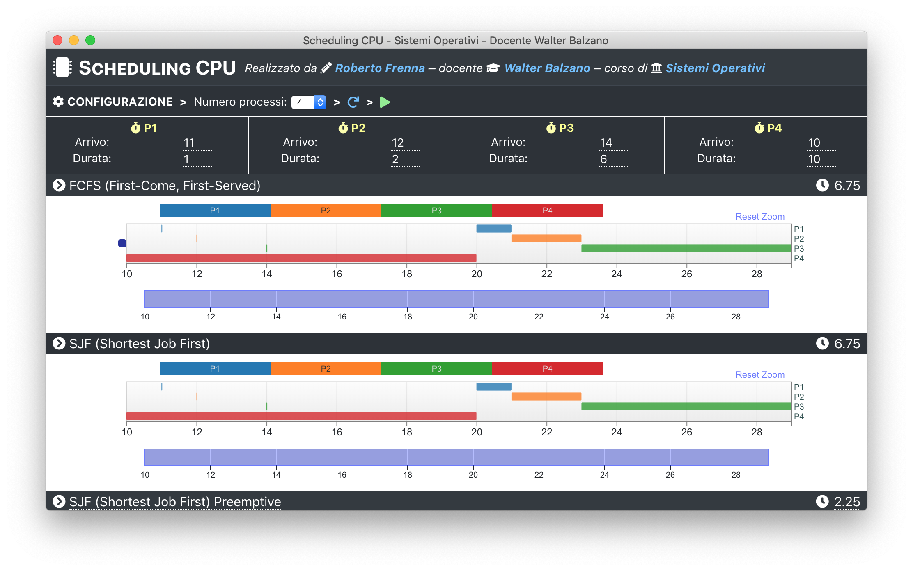

# CPU scheduling app - common source code

This is the shared code source used by the Electron and web apps.

## Synopsis

This app allows to easily configure and plot processes using the following scheduling algorithms:

- [First-come, first-served (FCFS)](https://en.wikipedia.org/wiki/FIFO_\(computing_and_electronics\))
- [Shortest Job First (SJF, pre-emptive and non pre-emptive)](https://en.wikipedia.org/wiki/Shortest_job_next)
- [Round Robin](https://en.wikipedia.org/wiki/Round-robin_scheduling)

The codebase is modular and well-documented, more scheduling algorithms can be easily added.

**NOTE:** since this was an university project, the app is currently only in Italian.

## Building and packaging

This repository only holds the shared codebase between the two repositories. Please checkout the
[Electron app](https://github.com/Robertof/cpu-scheduling-electron) and the
[web app](https://github.com/Robertof/cpu-scheduling-web).
